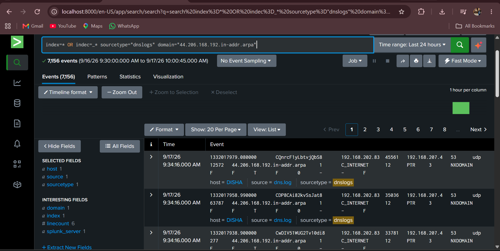
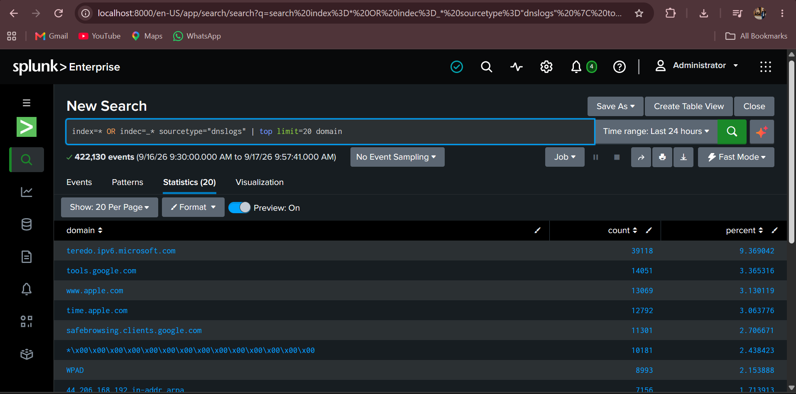
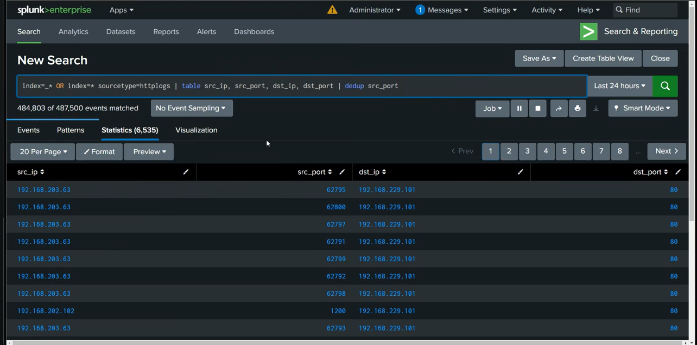

# DNS Log Monitoring and Analysis using Splunk

## Overview

This project demonstrates the collection, monitoring, and analysis of DNS logs from an Ubuntu system using Splunk.

DNS activity generated on the Ubuntu endpoint was collected and monitored in Splunk. Splunk Search Processing Language (SPL) was used to search and analyze the collected DNS events. The `dedup` command was also used to remove duplicate results and focus on unique DNS activity.

## Objective

The main objectives of this project are:

* Collect DNS logs from an Ubuntu system
* Monitor DNS activity using Splunk
* Search and analyze DNS events using SPL
* Identify unique DNS events
* Understand basic DNS log analysis in a SOC environment

## Technologies Used

* Ubuntu Linux
* Splunk
* Splunk Universal Forwarder
* Splunk Search Processing Language (SPL)
* DNS Logs

## Project Workflow

```text
Ubuntu System
      ↓
DNS Activity
      ↓
DNS Logs
      ↓
Splunk Universal Forwarder
      ↓
Splunk
      ↓
DNS Log Monitoring
      ↓
SPL Analysis
      ↓
Deduplication of Events
```

## Implementation

### 1. DNS Log Collection

DNS-related activity was generated and logged on the Ubuntu system. The logs were collected for monitoring and analysis.

### 2. Splunk Monitoring

The collected DNS logs were forwarded to Splunk and monitored through Splunk searches.

The Splunk interface was used to examine the incoming DNS events and review the available log fields.

### 3. DNS Log Analysis

Splunk Search Processing Language (SPL) was used to filter and analyze the collected DNS events.

### 4. Deduplication

The Splunk `dedup` command was used to remove duplicate results based on the selected field.

This helped focus the analysis on unique DNS events instead of repeatedly displaying duplicate entries.

## Screenshots

### 1. DNS Logs

DNS log data generated on the Ubuntu system.



### 2. DNS Monitoring in Splunk

The collected DNS events are monitored and searched in Splunk.



### 3. Dedup Analysis

The `dedup` command is used in Splunk to remove duplicate results and analyze unique DNS activity.



## Key Learnings

* Understanding DNS logs
* Collecting Linux logs for security monitoring
* Monitoring logs using Splunk
* Using SPL for log analysis
* Using `dedup` for removing duplicate search results
* Understanding a basic SOC log-monitoring workflow

## SOC Relevance

DNS monitoring is useful in security operations because DNS logs can provide visibility into domain-resolution activity. Analysts can use DNS events as part of investigations into unusual or suspicious network behavior.

This project demonstrates the basic workflow of collecting endpoint logs, monitoring them in a SIEM, and performing initial log analysis.

## Conclusion

This project demonstrates a basic DNS log monitoring and analysis workflow using Ubuntu and Splunk. It provides hands-on experience with log collection, SIEM monitoring, SPL-based searching, and event deduplication.
